# github-weld 🪢

Claude Code skills that close the loop on every change — from issue to merge, with context captured at each step. The result is a structured delivery history your future self, your team, or an LLM can actually learn from.

These skills are opinionated about *workflow*, not implementation — they work alongside whatever you're building.



## Skills

**`/gh-weld-issue`** — Every piece of work needs an anchor before the first line of code. Creates one via a guided interview: duplicate check, structured body, and label discovery.

**`/gh-weld-next`** — Connecting intent to execution is where most workflows leak data. Picks an open issue, creates a correctly-named branch, and hands off to implementation.

**`/gh-weld-ship`** — Shipping is the richest data moment in the delivery lifecycle. Wraps finished work in a PR, merges it, closes the issue, and exports session context.

**`/gh-weld-export`** — Git history captures what changed; session export captures why. Exports the Claude Code session as a Gist and posts a structured summary to any PR or issue.

**`/gh-weld-adopt`** — For when you started coding before creating an issue. Creates the issue retroactively, renames the branch, commits loose changes, and exports the session.

## Installation

Clone the repo and run the symlink script:

```bash
git clone https://github.com/WrathZA/github-weld
cd github-weld
bash symlink-global-skills.sh
```

This symlinks each skill directory into `~/.claude/skills/`, making them available in any project.

To update, pull and re-run the script — existing symlinks are left in place.

## Requirements

- [Claude Code](https://claude.ai/code)
- [gh CLI](https://cli.github.com/) authenticated (`gh auth login`)
- `git`
- `python3` (parses Claude Code session files to extract the conversation transcript for export to Gist)

## Conventions

Claude Code's permission and safety systems have non-obvious interactions with shell execution — pipes, heredocs, and inline `gh` arguments all cause problems in practice. [`.weld/conventions.md`](.weld/conventions.md) documents the patterns these skills follow so you don't have to rediscover them when extending or contributing.
